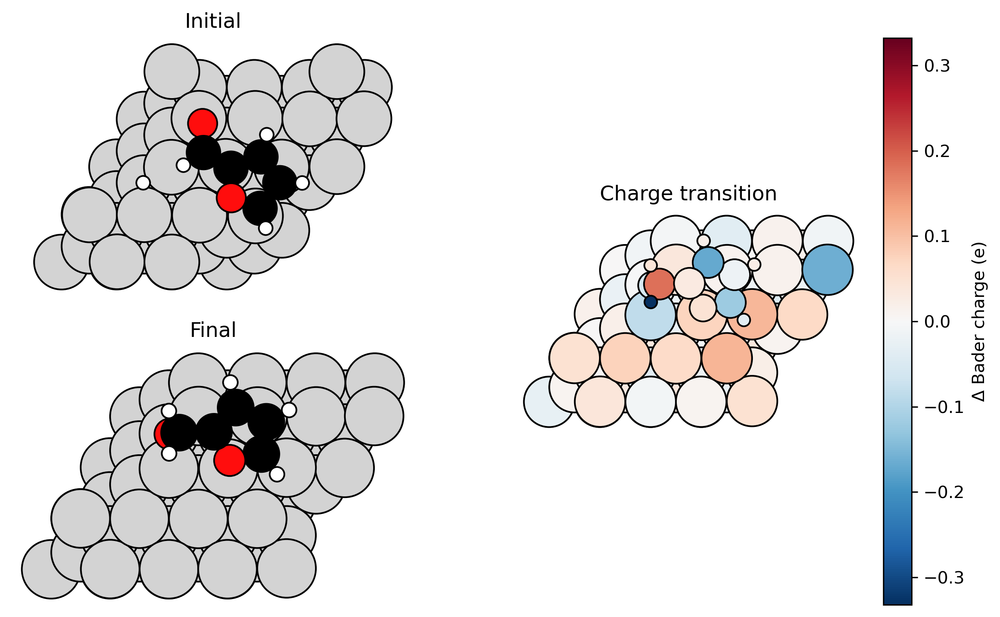
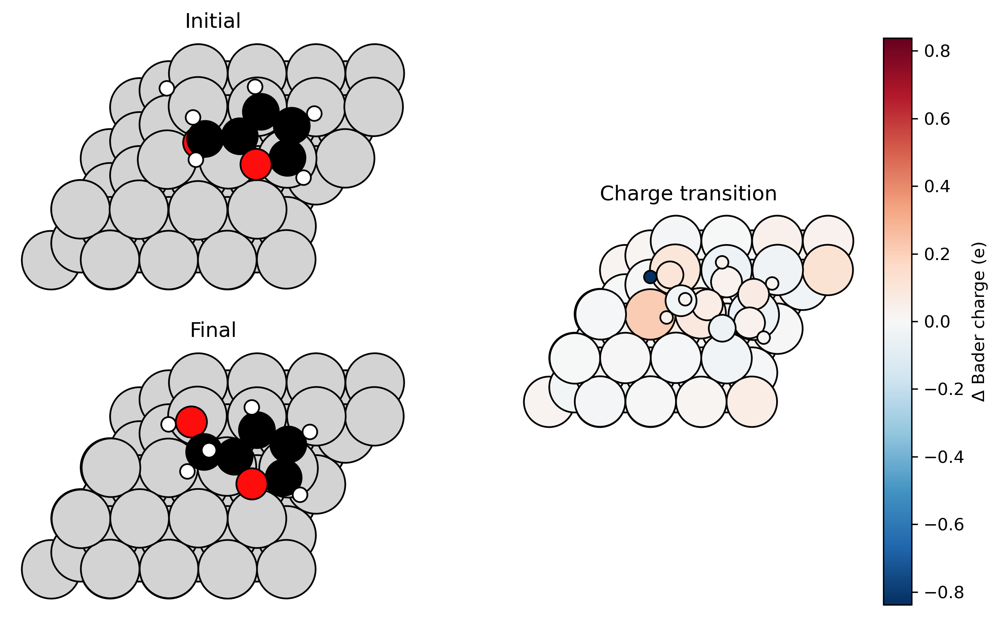

# BaderCharge_plotter
Leverages ASE, numpy and pyplot to calculate the differences in Bader charges between two structures acquired from VASP and then colour the different atoms according to the difference in charge (i.e., whether positive or negative).

Version 2 (v2) current release.

# General procedure

## Overview
This analysis will calculate the Bader charge difference between the initial and final stages of a transition state (e.g., NEB).

## Folder and file access
The atomic positions (POSCAR/CONTCAR) and the Bader charges (ACF.dat) will have been collected through VASP calculations. These will be placed within the initial and final folders of each reaction/transition, relative to the main.py file, which is the main file that executes the code. The names of the initial and final folders are respectively "ini" and "fin" by default and additional and/or replacement names (e.g., "initial", "final", "is", "fs") can be provided.

## Projection
Additionally, atoms will be shifted in a given direction in case they (particularly adsorbates) extend over the unit cell dimensions, especially in the x,y planes and will be relative to the atom in each system that possesses the highest radius. The user will need to input integers of the x, y shifts, which will be multiplied by the maximum covalent diameter in the system (i.e., input such integers as -1, 0, +1, etc., where negative = left/down shift and positive = right/up shift). That is, all of the atoms will be shifted left, right, up, or down depending on what input value and sign is input.

For reviewing images for shifting, one of the following methods must be selected and confirmed:
1: Same shift per (ini, fin) pair (That is, whatever shift is selected for the initial image will also be projected to the final image and each image set will be iterated through. The initial unprojected image will be displayed prior to assigning the shift and the final projected image will be displayed as well.)
2: Manual shift for EACH structure (That is, this expands from mode 1, though each individual image will be checked and projected rather than in pairs.)
3: Same shift for ALL images (That is, after the shift is applied to one image set, this will be globalised as a variable and then applied to all other images.)

If any of the inputs (see [Inputs](#inputs)) are not appropriately met with the program requirements, then the inputs will be looped and re-initiated for the user. 

## Inputs
### Mode selection
The inputs are as follows (N.B. if these are not followed, then these questions will be repeated until an appropriate response is provided):

Enter mode (1/2/3):

Confirm mode x? (y/n):

### Shifting
Previewing structure. (I.e., view the structure prior to shifting and then close it)

Press Enter to close the figure...

Manual shift using max_radius = x.xxx Å (Starts after closing the figure. This will provide that maximum covalent diameter, e.g., 2.480 Å for Ni)

Shift in x (multiples of diameter, N.B. negative = left/down, positive = right/up): (I.e., input the +/- integer for the shift in the x-direction, this number will be multiplied by the covalent diameter, and all atoms in the unit cell will be shifted by that distance and in that direction)

Shift in y (multiples of diameter, N.B. negative = left/down, positive = right/up): (Same as with the previous, but in the y-direction) 

Press Enter to close the figure...

Accept this result? (y/n): y (Starts after closing the figure.)

## Colour coding
After conducting the projections, the difference in Bader charge between both images will be calculated. From this, the initial and final atomic systems will be elementally colour-coded which can be configured (e.g., Ni = lightgray, C = black) and saved into an image and the final image will be reincluded adjacent and colour coded (default: red-blue) using a colormap depending on the Bader charge range. The initial and final images will be arranged vertically on the left-hand side of the image and the Bader charge transition image will be included singularly on the right-hand side of the image. Any Bader charge difference values below the given threshold (default: 0.005) will be zeroed and therefore not coloured. All images will be given as top view (default: ('0x,0y,0z')) and as single periodicity ((1,1,1)) by default and can be adjusted.

## Image saving
The figures will be saved in a new folder called "Bader_plots". Furthermore, if the ini and fin folders are nested within additional folders, the os.walk() function will find them, the folder locations will be stored and these new folders will be created within "Bader_plots" to save the images, so as to make them easier to find.

Example saved images are provided below.

# Key files, folders and inputs

## Folder structure

reactionORtransition/

-> ini/

->-> CONTCARorPOSCAR

->-> ACF.dat

-> fin/

->-> CONTCARorPOSCAR

->-> ACF.dat

I.e., CONTCAR/POSCAR and ACF.dat are mandatory for the code to work

E.g., , as provided, contains  and  folders that each contain "fin" and "ini" and likewise contain CONTCAR/POSCAR and ACF.dat. When saving images into , as the two key folders are contained within "C6", which in turn is nested within "Hydrogenation", this folder will create a subfolder called "Hydrogenation", into which the image files will be stored and entitled by these names connected with underscores (_). In the given example, this system outputs "Hydrogenation_C6.png" and "Hydrogenation_CH2O.png". See [Example](#example) below.

## Usage

python main.py ([`main.py`](main.py))

## Options for output adjustment, can be configured in main and/or function files

layout = "horizontal", "vertical", "split" #I.e., How the images should be displayed in the final figure

repeat = (1,1,1) #i.e., periodic cell expansion

views = [('0x,0y,0z')] #i.e., top view

INITIAL = ("ini","initial","is") #Default is to store key files of each transition in folders entitled "ini" (initial state) and "fin" (final state), or anything similar. These variables will store such possible names. If there are alternate names, then please include them manually

FINAL = ("fin","final","fs") #Default is to store key files of each transition in folders entitled "ini" (initial state) and "fin" (final state), or anything similar. These variables will store such possible names. If there are alternate names, then please include them manually
    
tol = 0.005 #Default tolerance, i.e., if the (abs) difference in Bader charge is less than 0.005, it will treated as 0
  
cmp = plt.cm.RdBu_r #Default colormap also in function, can be changed to any desired, plt already imported

save_dir="Bader_plots" #Save folder

element_colors = {"Ni": "lightgray", "C": "black",} #Define desired colors for atoms in POSCAR/CONTCAR if desired, else default colours will be used

## external function files
[`io_utils.py`](io_utils.py) #Collect file locations (POSCAR, CONTCAR, ACF.dat) for subsequent call

[`atoms.py`](atoms.py) #Load atoms

[`check.py`](check.py) #Ensure consistency between files, especially with number of atoms and atomic positions between POSCAR/CONTCAR and ACF.dat

[`analysis.py`](analysis.py) #Collect Bader charges and calculate charge difference between 2 states

[`plotting.py`](plotting.py) #Plot Bader charge and save figures

[`colors.py`](colors.py) #Set atomic colors and colormap for Bader charge

[`layouts.py`](layouts.py) #Set display configurations of ASE images (with colors)

[`geometry.py`](geometry.py) #Shifts in x,y direction where necessary

[`inputs.py`](inputs.py) #Different options of atomic shifting and image collection

# Example
Two examples are provided (the "C6" and "CH2O" folders), which you can use to observe the functionality of this code by running the main.py file. Please note that this is for single hydrogenation of the C6 atom of the furfural molecule and the O7 atom of the F-CH2O molecule. Feel free to delete these examples when running your own code. Please see two example figures below:

  <em>Figure 1: Example figure of bader charge changes of C6 hydrogenation of furfural.</em>

  <em>Figure 2: Example figure of bader charge changes of CH2O hydrogenation of furfural.</em>

